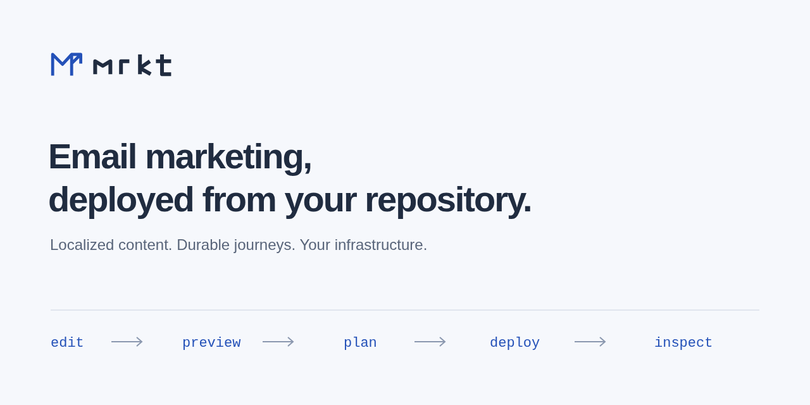
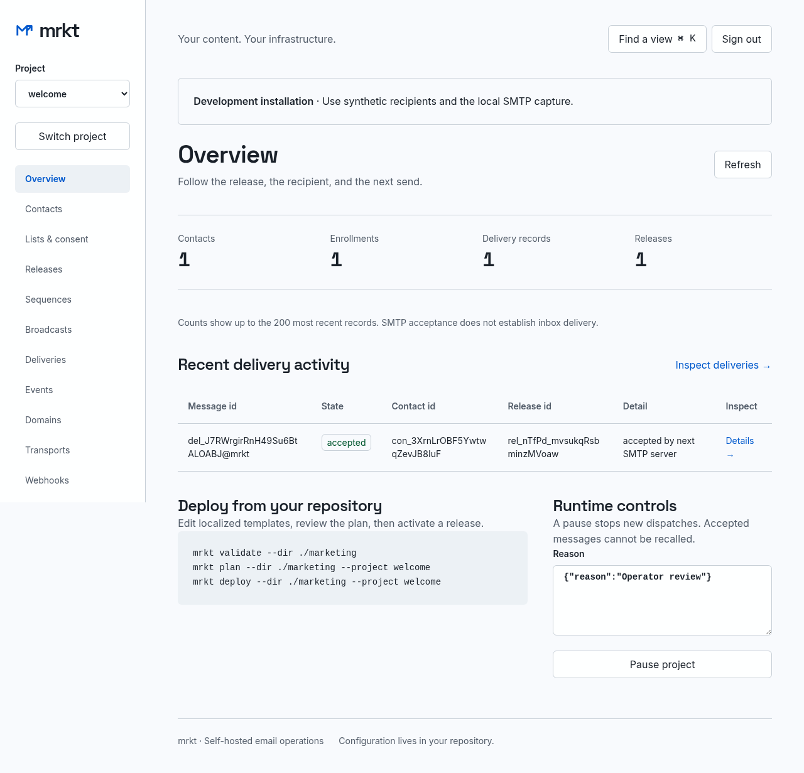

# mrkt

Self-hosted email marketing for teams that keep content in Git. Edit localized messages and workflows locally, preview, plan, deploy an immutable release, then inspect live consent and execution through the CLI, REST API, MCP, or browser.

One Go process, SQLite on a managed local volume, private S3-compatible artifacts, and asynchronous Litestream backups. No LLM, Node runtime, billing service, or paid agent is needed to operate it.



## Try it locally

Requires Docker with Compose. This configuration binds the UI, SMTP capture, and object storage to loopback and uses **publicly known development credentials**. Never expose it publicly.

```sh
git clone git@github.com:mattmezza/mrkt.git
cd mrkt
docker compose -f compose.yaml -f compose.dev.yaml build app
docker compose -f compose.yaml -f compose.dev.yaml run --rm app server init
docker compose -f compose.yaml -f compose.dev.yaml up -d
```

Initialization is an explicit, one-time step. Restart using `up -d`; do not reinitialize. Open [the local UI](http://localhost:8080) and sign in with `development-only-admin-token-change-me`. [Mailpit](http://localhost:8025) captures all development mail; no real recipient is contacted. Use only synthetic `example.test` recipients.

To use the local CLI, install Go and run `make build` (the precompiled embedded UI is included). Node is only needed to rebuild assets: `npm ci && npm run build`. Release images accept `MRKT_VERSION`, `MRKT_COMMIT`, and `MRKT_BUILD_TIME` Docker build arguments; `mrkt version` reports the embedded values.

```sh
export PATH="$PWD/bin:$PATH"
export MRKT_URL=http://localhost:8080
export MRKT_TOKEN=development-only-admin-token-change-me
mrkt init --preset welcome --dir marketing
printf '%s' '{"id":"welcome","name":"Welcome"}' | mrkt projects create
mrkt validate --dir marketing
mrkt preview --dir marketing --locale it-CH
mrkt plan --dir marketing
mrkt deploy --dir marketing
mrkt releases list --project welcome
```

The `welcome` preset's project ID is `welcome`. Choose `coming-soon`, `newsletter`, or `launch` for different editable workflows. Deploying content never grants consent. Submit a synthetic subscription through `/public/welcome/subscribe`, open its confirmation in Mailpit, and inspect the resulting journey. [The executable acceptance script](scripts/acceptance.mjs) demonstrates the entire flow, including one-click unsubscribe before a follow-up send.

For production, use scoped credentials from an environment/secret file rather than command arguments, and follow [deployment and recovery](docs/operations.md), [environment configuration](docs/environment.md), and [SMTP/domain setup](docs/sending.md). Do not use the development override.

## What is included

- Project-scoped contacts, typed attributes, list/purpose consent, double opt-in, suppression, CSV previews/import/export, durable abuse limits, and server-side Turnstile verification.
- Strict versioned manifests, localized English/Italian/Turkish presets, immutable content-addressed releases, optimistic deploys, rollback, pinned journeys, fake-clock simulation, and event-triggered broadcasts.
- Durable jobs, stable Message-IDs, frozen renders, final eligibility checks, explicit uncertain SMTP outcomes, authenticated SES/MTA feedback, and signed retryable business webhooks.
- Operational UI with sandboxed previews and execution explanations; REST/CLI/MCP share service authorization. The [official agent skill](skills/mrkt/SKILL.md) is versioned in this repository.
- Real S3/SMTP/browser/recovery acceptance fixtures, MIT code and original branding, dependency notices, and CI.

## Operational boundaries

Run **one active installation and one replication owner per database**. SQLite remains on local disk. Fence the old host before restoring; a database lease cannot fence another restored copy. Litestream is asynchronous and can lose transactions not yet replicated.

Restored databases start paused. An operator must reconcile possibly lost unsubscribes, complaints, SMTP acceptance, and webhook acknowledgements before audited resume. SMTP acceptance is not inbox delivery, and an ambiguous SMTP attempt is not automatically resent. These are not exactly-once or legal-compliance guarantees.

Artifact GC is deliberately conservative and dry-run-only: there is no proven complete inventory of every retained database restore point, so deleting objects could invalidate recovery. Retention can prune eligible operational database records; object reclamation requires a reviewed backup-aware procedure. Read [release notes and limitations](docs/releases/0.1.0.md) before production use.

## Documentation

| Task | Reference |
| --- | --- |
| Understand storage and execution | [Architecture and ADRs](docs/architecture.md) |
| Author content and workflows | [Manifest guide](docs/manifest.md), [JSON schema](schemas/manifest-v1.json), [presets](presets/) |
| Automate operations | [CLI](docs/cli.md), [REST/OpenAPI](docs/openapi.yaml), [API conventions](docs/api.md), [MCP](docs/mcp.md) |
| Integrate a product | [Synthetic producers and signed consumers](examples/) |
| Operate and recover | [Runbook](docs/operations.md), [configuration](docs/environment.md), [sending](docs/sending.md) |
| Evaluate the release | [Acceptance record](docs/acceptance.md), [browser checks](docs/browser-checks.md), [benchmark](docs/benchmark.md) |
| Contribute or report a vulnerability | [Contributing](CONTRIBUTING.md), [security](SECURITY.md) |

## Development

```sh
npm ci
npm run build
make build
go test ./...
go vet ./...
go test -race ./...
node scripts/acceptance.mjs
go test -tags=integration ./internal/artifact ./internal/mail ./deploy -v
```

The last two commands require the local MinIO/Mailpit services; the restore test additionally launches the pinned Litestream container. Nothing in these tests is an invitation to send to real subscribers.

MIT © Matteo Merola. See [LICENSE](LICENSE), [third-party notices](THIRD_PARTY_NOTICES.md), and [brand provenance](assets/brand/README.md).
